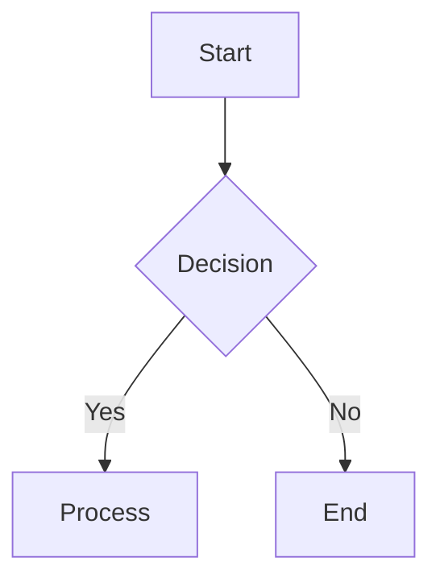

# /format — Markdown Formatting Guide

Quick reference for formatting Max persona responses with rich typography and visual elements.

---

## Quick Reference

| Element | Syntax | Use |
|:--------|:-------|:----|
| **Bold** | `**text**` | Strong emphasis |
| *Italic* | `*text*` | Emphasis |
| `Code` | `` `code` `` | Variables, functions, paths |
| Link | `[text](url)` | URLs |
| List | `- item` | Unordered items |
| Steps | `1. step` | Sequential procedures |
| Quote | `> text` | Citations, callouts |

---

## Headers

| Level | Syntax | When to Use |
|:------|:-------|:------------|
| H1 | `# Title` | Main title — one per document |
| H2 | `## Section` | Major sections |
| H3 | `### Subsection` | Subsections within H2 |
| H4 | `#### Minor` | Rare — sub-subsections |

---

## Mandatory Blocks

These blocks are **required** when the content type appears in a response:

### Code Blocks

Always use fenced blocks with language tags:

```markdown
```bash
npm install
```

```diff
- old line
+ new line
```
```

### Callouts

```markdown
:::tip
Best practice or recommendation
:::

:::warning
Caution — could cause confusion or mistakes
:::

:::danger
Destructive or irreversible action
:::
```

### Collapsible Sections

Use for optional depth, alternatives, or long lists:

```markdown
<details>
<summary>Click to expand</summary>

Hidden content here

</details>
```

---

## Tables

```markdown
| Left-aligned | Center | Right |
|:-------------|:------:|------:|
| Data         | Data   | Data  |
```

---

## Next Block Template

Every response ends with this:

```
─────────────────────────────────────────
Next:
A) 📋 Task description
B) 🧭 Planning description
   B1) 📋 Sub-option
   B2) 🔍 Sub-option
C) 🔍 Review description
D) Something else
─────────────────────────────────────────
```

---

## Category Emojis

| Emoji | Category |
|:------|:---------|
| 📋 | Task Management |
| 🧭 | Planning & Focus |
| 🔍 | Review & Analysis |
| 🐛 | Debugging & Tools |
| 🤖 | AI & Code Quality |
| 🗓️ | Session Lifecycle |
| 📖 | Framework Info |

<details>
<summary>Advanced Formatting</summary>

### Task Lists

```markdown
- [x] Completed task
- [ ] Incomplete task
```

### Footnotes

```markdown
Statement with footnote[^1].
[^1]: Footnote content.
```

### Math

```markdown
Inline: $E = mc^2$
Block: $$ \int e^{-x^2} dx $$
```

### Mermaid Diagrams

````markdown

````

</details>

---

## Best Practices

- **Consistency** — Uniform header hierarchy, formatting patterns
- **Readability** — Short paragraphs, lists for clarity, whitespace between sections
- **Visual hierarchy** — Headers for structure, callouts for emphasis, tables for comparison
- **Accessibility** — Alt text for images, semantic headers
